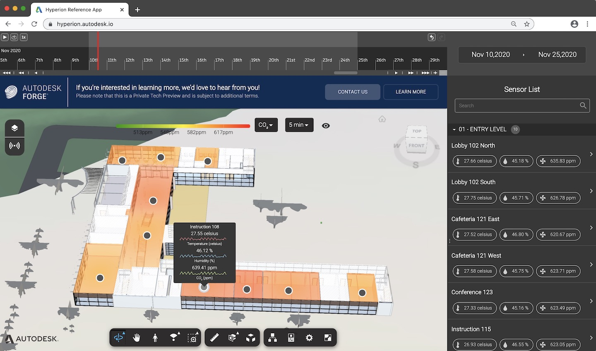

# forge-dataviz-iot-reference-app

This sample application demonstrates the functionality of the Forge Data Visualization extension. To learn more about the extension and the features it offers, see the [Data Visualization Extension Developer's Guide](https://forge.autodesk.com/en/docs/dataviz/v1/developers_guide/introduction/overview/).

## Directory Structure

    .
    ├── assets                  # Static svg and png files
    ├── client                  # Client-side code + configuration
    ├── docs                    # Additional documentation on how to upload a Revit model, setup Azure etc.
    ├── scss                    # SCSS files
    ├── server                  # Server-side configuration - router, sample synthetic/CSV data
    ├── shared                  # Config files shared between client and server
    ├── tools                   # Tools to use in your own webpack file
    ├── package.json
    ├── webpack.config.js
    ├── LICENSE
    └── README.md

## Setup

### Prerequisite

To successfully run this Reference Application, you need a _Forge account_. If you do not have a Forge account, see [Creating your Forge account](https://learnforge.autodesk.io/#/account/).

### Installing and Running the Reference Application

To install and run the Reference Application, see the [Data Visualization Extension QuickStart](https://forge.autodesk.com/en/docs/dataviz/v1/developers_guide/quickstart/).

## Advanced Users

### Customization options

If you'd like to add your own customization on top of the Reference Application baseline, you can modify the following files:

-   _custom.scss_ : Override or add custom styling to your application.
-   _client/pages/CustomPage.jsx_ : Create a custom page for your application.
-   _server/CustomRouter.js_ : Override or add new API routes.

## Further Reading

Developer's Guide - https://forge.autodesk.com/en/docs/dataviz/v1/developers_guide
API Reference - https://forge.autodesk.com/en/docs/dataviz/v1/reference/Core/

## License

This sample app uses an [MIT License](LICENSE)
