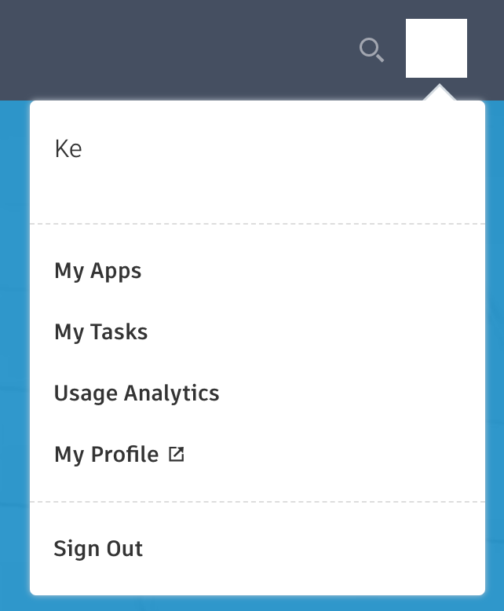

# forge-dataviz-iot-reference-app


This is a sample application that demonstrates the functionality of the Forge Viewer Data Visualization extension. To learn more about the extension and the features it offers, check out https://forge.autodesk.com/en/docs/dataviz/v1/developers_guide/introduction/overview/.


#### Directory Structure
    .
    ├── assets                  # Static svg and png files
    ├── client                  # Client-side code + configuration
    ├── docs                    # Additional documentation on how to upload a Revit model, setup Azure etc.
    ├── scss                    # SCSS files
    ├── server                  # Server-side configuration - router, sample synthetic/csv data
    ├── shared                  # Config files shared between client and server.
    ├── tools                   # Tools to use in your own webpack file
    ├── package.json
    ├── webpack.config.js
    ├── LICENSE
    └── README.md

### Setup

#### Install nodejs (version 12+)

Please download the nodejs package from : https://nodejs.org/en/download/

#### Git clone

```console
git clone https://github.com/Autodesk-Forge/forge-dataviz-iot-reference-app.git
```

#### Run the App with our public model and access token

Yes, you are right. Just one command to get it up and running!

```console
cd forge-dataviz-iot-reference-app
npm install
npm run dev
```

Open your browser:
http://localhost:9000

## For Advanced Users

### Sign up for Autodesk Forge Developer account and create a Forge App

1. Go to https://forge.autodesk.com/
   a. Sign in if you have an account
   b. Create an account if you don't have one
2. Select your `avatar` on the top/right corner and choose `My Apps`
   
3. Click `Create App >` button on the top/right.
4. Select `API`
   Misc API
5. Add App Information:
   App Name
   App Description
   Callback URL
   Your Website URL
6. Click `Create APP` Button
7. Once it's finished, you will get the `Client Id` and `Client Secret`
8. For local development the simplest way is to copy `server/env_template` to `.env` in the same folder.
9. Open `.env` file with text editor or IDE

    - Copy and paste the `Client Id` from Step 7 as the value for `FORGE_CLIENT_ID`

    - Copy and paste the `Client Secret` from Step 7 as the value for `FORGE_CLIENT_SECRET`

    - Add a value for `FORGE_BUCKET`. Remember `FORGE_BUCKET` is unique to all users.
      You must give it a unique name. For example - `yourappname.yourwebsite` url

    - Save the changes to `.env` file

```console
#Start the app with ENV=local like this
# For Windows
set ENV=local && npm run dev

# For Mac/Unix/Linux
ENV=local npm run dev
```

For a complete step-by-step walk through, follow this tutorial: [GET STARTED WITH FORGE IN 3 STEPS](https://forge.autodesk.com/developer/start-now/signup)


### Setting up a CSV data adapter locally.
Use CSV files as the Time Series datasource by providing the following configuration values in a `.env` file

   a. Change the `ADAPTER_TYPE` to `csv`

   b. `CSV_MODEL_JSON` model file location. For example content format, please refer to: [device-models.json](./server/gateways/synthetic-data/device-models.json)

   c. `CSV_DEVICE_JSON` device file location. For example content format, please refer to: [devices.json](./server/gateways/synthetic-data/devices.json)

   d. `CSV_FOLDER` csv folder/directory location. For example content format, please refer to: [Hyperion-1.csv](./server/gateways/csv/Hyperion-1.csv)

   e. Provide Start and End data for CSV file via `CSV_DATA_END` and `CSV_DATA_START`. These values will override the timeline. Format: YYYY-MM-DDTHH:MM:SS.000Z

   f. optional `CSV_DELIMITER` default to `\t`

   g. optional `CSV_LINE_BREAK` default to `\n`

   h. optional `CSV_TIMESTAMP_COLUMN` default to `time`

   i. optional `CSV_FILE_EXTENSION` default to `.csv`


### Migrating to the Azure Data Adapter

Please read https://forge.autodesk.com/en/docs/dataviz/v1/developers_guide/advanced_topics/migrate_to_azure/


## Upload your Revit model

You can also upload your own model using by following these [instructions](https://dev.forge.autodesk.com/en/docs/dataviz/v1/developers_guide/quickstart/replace_model/).


## Customization options

If you'd like to add your own customization on top of our baseline, then you can easily do so by modifying the following files:

-   custom.scss : Override or add custom styling to your application
-   client/pages/CustomPage.jsx : Create a custom page for your application.
-   server/CustomRouter.js : Override or add new API routes

## Further Reading
https://forge.autodesk.com/en/docs/dataviz/v1/developers_guide/introduction/

## License
This sample app uses an [MIT License](LICENSE)