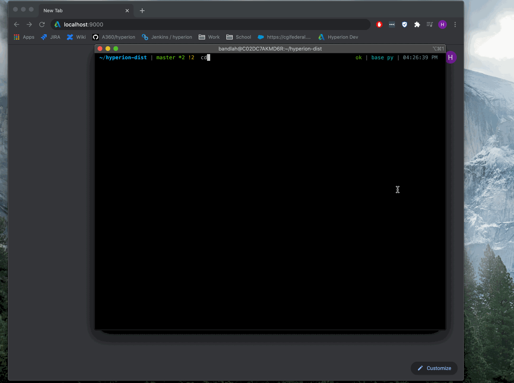

## How to upload a Revit model

You can upload your revit model by following these steps:

1. Setup your `.env` file

    ```
    > cd server
    > cp env_template .env
    ```

    - Open `.env` file with text editor or IDE
    - Add your Forge `Client_Id` as the value for `FORGE_CLIENT_ID`
    - Add your `Client Secret` as the value for `FORGE_CLIENT_SECRET`
    - Add a value for `FORGE_BUCKET` with your **unique url**, for example: `yourappname`.`yourwebsite` url

        **Remember:** `FORGE_BUCKET` is unique to all users.

    - Save the changes to `.env` file

2. Run your app locally

    ```
    > ENV=local npm run dev
    ```

3. Point your favorite browser at `localhost:9000/upload` and hack away!


